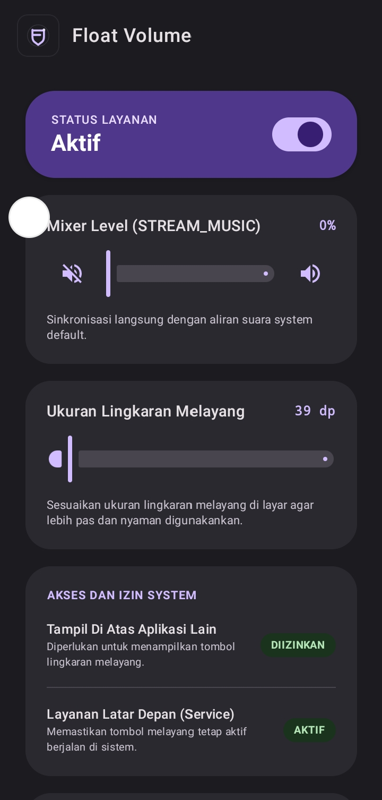
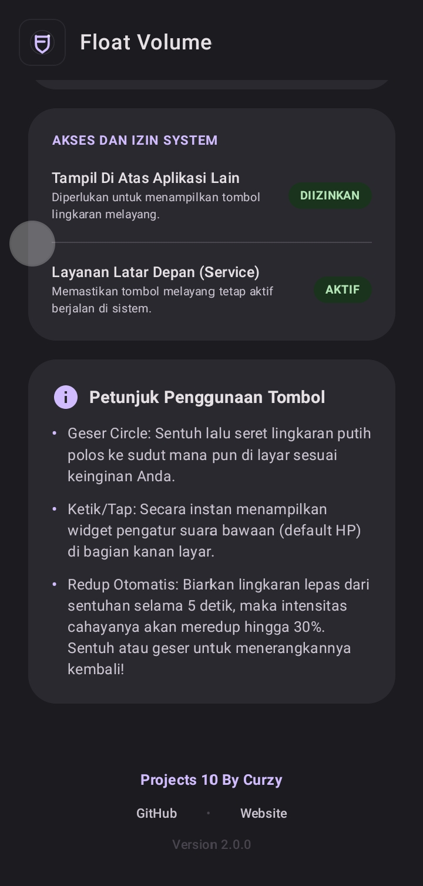

<p align="center">
  
</p>

<h1 align="center">Float Volume</h1>
<p align="center">
  <strong>Privacy-friendly floating volume control for Android</strong>
</p>

<p align="center">
  <a href="https://github.com/Curzyori/float-volume/tree/main/version"><strong>📦 Current Version Build</strong></a>
</p>

<div align="center">

[](https://github.com/Curzyori/float-volume/stargazers)
[](https://github.com/Curzyori/float-volume/network/members)
[](LICENSE.md)
[](#)

</div>

<p align="center">
  <a href="#-why-float-volume">Why This</a> ·
  <a href="#-key-features">Features</a> ·
  <a href="#-installation">Installation</a> ·
  <a href="#-preview">Preview</a>
</p>

---

## 🕒 Why Float Volume?

Most Android volume controls are either too intrusive, packed with ads, or visually disconnected from the system. Float Volume solves that with a lightweight floating control that stays accessible without breaking focus.

The main highlight is the **transparent floating icon**. It sits above your screen like a subtle assistive control, giving quick access to volume adjustment without opening system panels repeatedly.

---

## 🎯 Key Features

| Feature | Status | Description |
| :--- | :---: | :--- |
| **Transparent Floating Icon** | ✅ | Subtle floating overlay icon that stays accessible without blocking the screen. |
| **Volume Control Overlay** | ✅ | Quickly adjust Android volume from a floating interface. |
| **Ad-Free Experience** | ✅ | No ads, no tracking, no noisy monetization layer. |
| **Privacy-Friendly** | ✅ | Designed as a local Android utility with minimal data exposure. |
| **Material Design 3** | ✅ | Modern Android UI language with clean spacing and tactile controls. |
| **Prestige-Safe Stealth Aesthetic** | ✅ | Dark, minimal, premium visual direction for daily-use utility apps. |

---

## 🛠 Tech Stack

- **Platform:** Android
- **Language:** Kotlin
- **Build System:** Gradle (Gradle Kotlin DSL)
- **Design:** Material Design 3
- **UX Direction:** Prestige-Safe Stealth Aesthetic
- **License:** GPL-3.0

---

## 📦 Installation

Download the latest APK from the [version folder](https://github.com/Curzyori/float-volume/tree/main/version):

| Version | File |
| :--- | :--- |
| v4.0.0 | `Float-Volume-v4.0.0.apk` |
| v3.1.0 | `Float-Volume-v3.1.0.apk` |
| v3.0.0 | `Float-Volume-v3.0.0.apk` |
| v2.0.0 | `Float-Volume-v2.0.0.apk` |

### Build from Source

```bash
git clone https://github.com/Curzyori/float-volume.git
cd float-volume
./gradlew assembleRelease
```

---

## 🖼️ Preview

<p align="center">
  
  
</p>

---

## 📄 License

This project is released under the **GNU General Public License v3.0** — see [LICENSE.md](LICENSE.md) for full text.

<sub>Built with passion as the 10th Project of the 50 Projects Challenge by **@curzyori**</sub>
